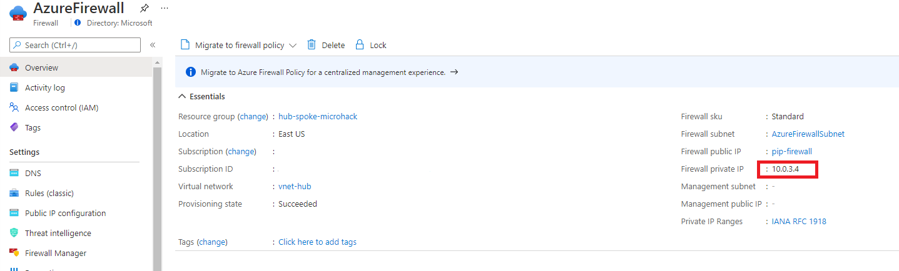

# **Azure Hub Spoke MicroHack**

# Contents

[MicroHack introduction and context](#Introduction)

[Pre-requisites](#Pre-requisites)

[Challenge 1 : Working with user defiend route UDR and Network Security Group NSG](#Challenge-1:-Working-with-user-defiend-route-UDR-and-Network-Security-Group-NSG)

[Challenge 3 : Route internet traffic through Azure Firewall](#Challenge-2:-Route-internet-traffic-through-Azure-Firewall)

[Challenge 3: Control network with Aziure Policies](#Challenge-3:-Control-network-with-Azure-Policies)

[Challenge 3: Monitoring](#Challenge-4:-Monitoring)


# Introduction

Azure hub-spoke network topology can be a core component in a customer's Azure foundation. In [this article](https://docs.microsoft.com/en-us/azure/cloud-adoption-framework/ready/enterprise-scale/network-topology-and-connectivity), the Enterprise Scale Framework explains how hub spoke may be used to create a network topology underpinning customer's foundation.
It is therefore important to understand how hub-spoke enables connectivity within Azure. The purpose of this MicroHack is to build that understanding by exploring some of the capabilities.
The lab starts with a single Hub with Spoke VNETs and default routing. We then connect a simulated on-premise location via S2S VPN. 
Prior to starting this MicroHack, please familiarize yourself with routing in Azure by reviewing the documentations inthe follow links.

[Implement a secure hybrid network](https://docs.microsoft.com/en-us/azure/architecture/reference-architectures/dmz/secure-vnet-dmz?tabs=portal)
[Hub-spoke network topology in Azure](https://docs.microsoft.com/en-us/azure/architecture/reference-architectures/hybrid-networking/hub-spoke?tabs=cli)

# Objectives

After completing this MicroHack you will:

- Know how to build a hub-and-spoke topology in Azure
- Understand routing with the hub-and-spoke architecture
- Understand how custom routing works and know how to build some custom routing scenarios
- Understand how to user Azure Firewall in hub-and-spoke topology

# Lab

The lab consists of a Hub and Spoke in the region you choose and a simulated On-premise location in same region.
Each of the Spoke and On-prem VNETs contains a Virtual Machine running a basic web site. The hub VNET contains an Active Directory Domain Controller.
During the course of the MicroHack you will connect the Spoke and Hub VNETs and the On-premise site, deploy an additional spokes, and manipulate and observe routing.
At the end of the lab your deployment looks like this


# Pre-requisites

## Overview

In order to use the MicroHack time most effectively, the following tasks should be completed prior to starting the session.

With these pre-requisites in place, we can focus on building the differentiated knowledge in Azure Networking that is required when working with the product, rather than spending hours repeating relatively simple tasks such as setting up Virtual Networks and Virtual Machines. 

At the end of the pre-requisites your base lab build looks as follows:


In summary:

- "On-Premises" environment simulated by Azure Virtual Network
- On-Premises contains a management VM (*onprem-mgmt-vm*) and a dns server VM (*onprem-dns-vm*)
- On-Premises is connected to Azure via a Site-to-Site VPN
- Azure contains a simple Hub and Spoke topology, containing a management VMs in the spokes (*az-mgmt-vm, az-mgmt2-vm, az-srv-vm*) and a dns server VM in the hub (*az-dns-vm*)
- Azure Bastion is deployed in hub VNet to enable easy remote desktop access to the Windows VMs
- All of the above is deployed within a single resource group called *hub-spoke-microhack-rg*

## Task 1 : Deploy Template

We are going to use a predefined Terraform template to deploy the base environment. It will be deployed in to *your* Azure subscription, with resources running in the your specified Azure region.

To start the terraform deployment, follow the steps listed below:

- Login to Azure cloud shell [https://shell.azure.com/](https://shell.azure.com/)
- Ensure that you are operating within the correct subscription via:

`az account show`

- Clone the following GitHub repository 

`git clone https://github.com/latj/hub-spoke-microhack`

- Go to the new folder hub-spoke-microhack and start the deployment 

`az deployment sub create     --template-uri https://raw.githubusercontent.com/latj/hub-spoke-microhack/master/azuredeploy.json --location eastus`

- Choose a suitable password to be used for your Virtual Machines administrator account (username: AzureAdmin)

- Wait for the deployment to complete. This will take around 45 minutes (the VPN gateways take a while).

## Task 2 : Explore and verify the deployed resources

- Verify you can access all four Virtual Machine via Azure Bastion

Username: AzureAdmin

Password: {as per above step}

- Verify that your VNet Peering and Site-to-site VPN are funcitoning as expected. The easiest way to do this is as follows; Once you have Azure Bastion access to the desktop of *az-mgmt-vm*, launch remote desktop (mstsc), and attempt a connection to *onprem-mgmt-vm* (IP address 192.168.0.5). You should recieve the login prompt.


# Challenge 1: Understand Network Ssecurity Groups 

In the spoke vnet it is deployed a loadbalance and two VMs as backend pool. in this challange we will enable Network Security Groups (NSG) to filter the traffic 

## Task 1 : Control network access to VM with Network Security Groups

In Azure you can use an Azure network security group (NSG) to filter network traffic to and from Azure resources in an Azure virtual network. A network security group contains security rules that allow or deny inbound network traffic to, or outbound network traffic from, several types of Azure resources. For each rule, you can specify source and destination, port, and protocol.
A network security group can be associated on a subnet or on NIC on virtual machine.
More info about how it works [Network security group - how it works](https://docs.microsoft.com/en-us/azure/virtual-network/network-security-group-how-it-works)

In this task we need to block traffic to the VMs in the spoke subnet on port 80 from all other subnets in Azure and OnPrem, but Allow HTTP(80) traffic to the loadbalancer.

- that is allready exist an NSG that you can used .

````Bash
az network nsg show -g "hub-spoke-microhack" -n "nsg-spoke-resources"
````

- Create inbouond rule in NSG

````Bash
az network nsg rule create -g "hub-spoke-microhack" --nsg-name nsg-spoke-resources -n Allow_LB_HTTP --priority 4010 --source-address-prefixes "*" --source-port-ranges '*' --destination-address-prefixes "10.100.4.0" --destination-port-ranges '80' --access Allow --protocol Tcp --description "Deny from Azure Subnet IP address ranges on 80."

````

- Assign NSG to the subnet of the *az-srv-vm*.

````Bash
az network vnet subnet update -g "hub-spoke-microhack-rg"  -n "ServerSubnet" --vnet-name spoke-vnet --network-security-group spoke-vnet-srv-nsg
````

# Challenge 1: Understand routing and vNet peering 

In this challenge we will work with routing and peered Virtual Network. we start by adding one more spoke virtual network. 

## Task : Deploy a new spoke Virtual Network

Azure Virtual Network (VNet) is the fundamental building block for your private network in Azure. VNet enables many types of Azure resources, such as Azure Virtual Machines (VM), to securely communicate with each other, the internet, and on-premises networks. VNet is similar to a traditional network that you'd operate in your own data center, but brings with it additional benefits of Azure's infrastructure such as scale, availability, and isolation.

In this task you need to the vnet, that can be done by clicking in the portal or run the following script in cloud shell.

- Create a new spoke nvet with a subnet .

````Bash
az network vnet create -g hub-spoke-microhack -n vnet-spoke2 --address-prefix 10.200.0.0/16 --subnet-name snet-spoke-resources --subnet-prefix 10.200.0.0/24
````

- Then we need to peer the the newly created with the hub vnet. that is done in two step first fron spoke the secound from hub.  

````Bash
    # Creates peering between vnets
    az network vnet peering create -g hub-spoke-microhack  -n spoke2-hub-peer --vnet-name vnet-spoke2 --remote-vnet vnet-hub --allow-vnet-access  --use-remote-gateways
    az network vnet peering create -g hub-spoke-microhack  -n hub-spoke-peer --vnet-name vnet-hub --remote-vnet vnet-spoke2 --allow-vnet-access --allow-forwarded-traffic --allow-gateway-transit
````

- Create a VM in the new subnet/Virtual Network.


````Bash
    az network nic create --resource-group hub-spoke-microhack --name nic-mgmt-server --subnet snet-spoke-resources --private-ip-address 10.200.0.4 --vnet-name vnet-spoke2
    az vm create  --resource-group hub-spoke-microhack --name vm-mgmt-server --image win2019datacenter --nics nic-mgmt-server --admin-username AzureAdmin
````

- Verify that your can access the new VM as expected. The easiest way to do this is as follows; Once you have Azure Bastion access to the desktop of *az-dns-vm*, launch remote desktop (mstsc), and attempt a connection to *az-srv2-vm* (IP address 10.200.0.4). You should recieve the login prompt.

## Task : Check the routing for Virtual Machines

We will check the routing configuration of the first webserver in the spoke netwotk *vm-web-server0*, that can be done by using the commands CLI below or using the portal.


- Show the routing for vm *vm-web-server0* by specifiying the nic *nic-web-server0*.

````Bash
    az network nic show-effective-route-table -g "hub-spoke-microhack" -n "nic-web-server0" --output table
````

### :point_right: The result will show the following.


> 1st route shows the addressprefix of the *vnet-spoke* nexthop VirtualNetwork named VNetLocal in CLI
> 2nd route shows the addressprefix of the peered vnet, with nexthop VNet peering
> 3rd route shows the addressprefix of the onprem, with nexthop VirtualNetworkGateway
> 4th route shows the 0.0.0.0/0, with nexthop Internet
> The rest show addressprefixes that will be droped

### :point_right: In this senario all traffic to internet will breakout directly in the virtual network.

You can read more about routing in Azure [here](https://docs.microsoft.com/en-us/azure/virtual-network/virtual-networks-udr-overview#default)


- Now check the routing for  *vm-mgmt-server* by specifiying the nic *nic-mgmt-server*.

````Bash
    az network nic show-effective-route-table -g "hub-spoke-microhack" -n "nic-mgmt-server" --output table
````

### :point_right: Compare then ae that any differernces

:question: Will *vm-web-server0* and *vm-mgmt-server* be able to communicate?

:question: Why can't they communicate?

- Peering connections are non-transitive, low latency connections between virtual networks. Once peered, the virtual networks exchange traffic by using the Azure backbone without the need for a router.
More infomation [Virtual Network Peering](https://docs.microsoft.com/en-us/azure/virtual-network/virtual-network-peering-overview#connectivity)


# Challenge 2: Route internet traffic through Azure Firewall

In this challenge you will explore how we can make our spoke communicate by sending all traffic through a Firewall, instead of go direct to Internet. You will build a secure hub in Azure. Routing all traffic directly to the Azure Firewall.


## Task 1: Deploy Azure Firewall

In the Azure Portal, deploy a new Azure Firewall instance in the hub-vnet. A subnet named "AzureFirewallSubnet" has been already created for you. 


> Please note that the "Forced tunneling" switch must be disabled. The switch allows forwarding internet traffic to custom next hops (including gateways connected to remote networks) after it has been inspected by Azure Firewall. In this scenario, you are using Azure Firewall as your secure internet edge and want your internet traffic to egress to the internet directly, after being inspected by Azure Firewall.

Your Azure Firewall instance will take about 10 minutes to deploy. When the deployment completes, go to the new firewall's overview tile a take note of its *private* IP address. 

## Task 2: Configure a default route via azure Firewall

In the Azure portal, go to your Azure Firewall instance's "Overview" and take note of its private IP address:



Go to the Route Table "spoke-vnet-rt" and modify the next hop of the default route that you defined in the previous challenge. To do so, click on “Routes” on the menu on the left, find the custom default route that you defined in the previous challenge and click on it. Replace the next hop "Virtual Network Gateway" with the private IP of your Azure firewall instance. 


Verify that you no longer have connectivity to the internet from the az-mgmt-vm. Connections are now being routed to Azure Firewall, which is running with the default "deny all" policy.

## Task 3: Implement policy with Azure Firewall rules to connect to on-premixes

Configure Azure Firewall to implement the same access as before :

- Access from spoke-vnet to onprem-vnet is allowed
- Access from spoke-vnet to spoke-vnet is allowed
- Access to any destination is denied

In the Azure Portal, create a new application rule collection for Azure Firewall as shown in the screenshot below.


Confirm that you can now access by usering following command


## Task 4: Enable access to WVD endpoints via Azure Firewall


## :checkered_flag: Results

You have implemented a secure internet edge based on Azure Firewall, which allows Contoso to control internet access for the wvd-workstation without routing traffic to the on-prem proxy. This approach reduces latency for connections between the wvd-workstation and the WVD control plane endpoints and helps improve the WVD user experience. It also allows Contoso to provide WVD users with access to external, trusted web sites directly from Azure.

# Challenge 3: Control network with Azure Policies


# Challenge 4: Monitoring

# Finished? Delete your lab

- Delete the resource group privatelink-dns-microhack-rg

Thank you for participating in this MicroHack!


