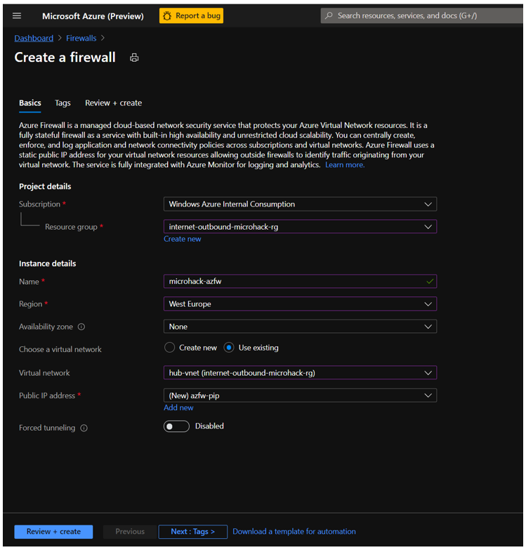
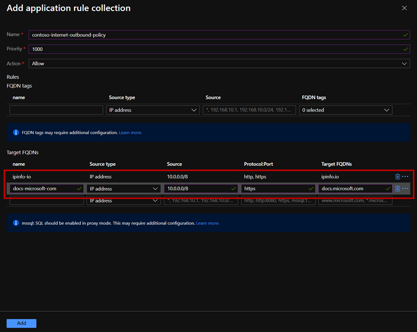

# **Azure Hub Spoke MicroHack**

# Contents

[MicroHack introduction and context](#Scenario)

[Pre-requisites](#Pre-requisites)

[Challenge 1 : Working with user defiend route UDR and Network Security Group NSG](#Challenge-1:-Working-with-user-defiend-route-UDR-and-Network-Security-Group-NSG)

[Challenge 3 : Route internet traffic through Azure Firewall](#Challenge-2:-Route-internet-traffic-through-Azure-Firewall)

[Challenge 3: Control network with Aziure Policies](#Challenge-3:-Control-network-with-Azure-Policies)

[Challenge 3: Monitoring](#Challenge-4:-Monitoring)

# Scenario

TBD

## Context

TBD

# Pre-requisites

## Overview

In order to use the MicroHack time most effectively, the following tasks should be completed prior to starting the session.

With these pre-requisites in place, we can focus on building the differentiated knowledge in Azure Networking that is required when working with the product, rather than spending hours repeating relatively simple tasks such as setting up Virtual Networks and Virtual Machines. 

At the end of the pre-requisites your base lab build looks as follows:

In summary:

- "On-Premises" environment simulated by Azure Virtual Network
- On-Premises contains a management VM (*onprem-mgmt-vm*) and a dns server VM (*onprem-dns-vm*)
- On-Premises is connected to Azure via a Site-to-Site VPN
- Azure contains a simple Hub and Spoke topology, containing a management VMs in the spokes (*az-mgmt-vm, az-mgmt2-vm, az-srv-vm*) and a dns server VM in the hub (*az-dns-vm*)
- Azure Bastion is deployed in hub VNet to enable easy remote desktop access to the Windows VMs
- All of the above is deployed within a single resource group called *hub-spoke-microhack-rg*

## Task 1 : Deploy Template

We are going to use a predefined Terraform template to deploy the base environment. It will be deployed in to *your* Azure subscription, with resources running in the your specified Azure region.

To start the terraform deployment, follow the steps listed below:

- Login to Azure cloud shell [https://shell.azure.com/](https://shell.azure.com/)
- Ensure that you are operating within the correct subscription via:

`az account show`

- Clone the following GitHub repository 

`git clone https://github.com/latj/hub-spoke-microhack`

- Go to the new folder hub-spoke-microhack and initialize the terraform modules and download the azurerm resource provider

`terraform init`

- Now run apply to start the deployment (When prompted, confirm with a **yes** to start the deployment)

`terraform apply`

- Choose you region for deployment (location). E.g. eastus, westeurope, etc

- Choose a suitable password to be used for your Virtual Machines administrator account (username: AzureAdmin)

- Wait for the deployment to complete. This will take around 30 minutes (the VPN gateways take a while).

## Task 2 : Explore and verify the deployed resources

- Verify you can access all four Virtual Machine via Azure Bastion

Username: AzureAdmin

Password: {as per above step}

- Verify that your VNet Peering and Site-to-site VPN are funcitoning as expected. The easiest way to do this is as follows; Once you have Azure Bastion access to the desktop of *az-mgmt-vm*, launch remote desktop (mstsc), and attempt a connection to *onprem-mgmt-vm* (IP address 192.168.0.5). You should recieve the login prompt.

# Challenge 1: Understand vNet peering, UDR and NSG 

## Task : Apply NSG on spoke Virtual Network
## Task : Deploy a new spoke Virtual Network

## Task : Deploy a new Virtual Machine inside the spoke Virtual Network

# Challenge 2: Route internet traffic through Azure Firewall

In this challenge you will explore how we can send all traffic through a Firewall, instead of go direct to Internet. You will build a secure hub in Azure. Routing all traffic directly to the Azure Firewall.

## Task 1: Deploy Azure Firewall

In the Azure Portal, deploy a new Azure Firewall instance in the hub-vnet. A subnet named "AzureFirewallSubnet" has been already created for you. 

> Please note that the "Forced tunneling" switch must be disabled. The switch allows forwarding internet traffic to custom next hops (including gateways connected to remote networks) after it has been inspected by Azure Firewall. In this scenario, you are using Azure Firewall as your secure internet edge and want your internet traffic to egress to the internet directly, after being inspected by Azure Firewall.

Your Azure Firewall instance will take about 10 minutes to deploy. When the deployment completes, go to the new firewall's overview tile a take note of its *private* IP address. 

## Task 2: Configure a default route via azure Firewall

In the Azure portal, go to your Azure Firewall instance's "Overview" and take note of its private IP address:

Go to the Route Table "spoke-vnet-rt" and modify the next hop of the default route that you defined in the previous challenge. To do so, click on “Routes” on the menu on the left, find the custom default route that you defined in the previous challenge and click on it. Replace the next hop "Virtual Network Gateway" with the private IP of your Azure firewall instance. 

Verify that you no longer have connectivity to the internet from the az-mgmt-vm. Connections are now being routed to Azure Firewall, which is running with the default "deny all" policy.

## Task 3: Implement policy with Azure Firewall rules to connect to on-premixes

Configure Azure Firewall to implement the same access as before :

- Access from spoke-vnet to onprem-vnet is allowed
- Access from spoke-vnet to spoke-vnet is allowed
- Access to any destination is denied

In the Azure Portal, create a new application rule collection for Azure Firewall as shown in the screenshot below.

Confirm that you can now access by usering following command

## Task 4: Enable access to WVD endpoints via Azure Firewall

## :checkered_flag: Results

You have implemented a secure internet edge based on Azure Firewall, which allows Contoso to control internet access for the wvd-workstation without routing traffic to the on-prem proxy. This approach reduces latency for connections between the wvd-workstation and the WVD control plane endpoints and helps improve the WVD user experience. It also allows Contoso to provide WVD users with access to external, trusted web sites directly from Azure.

# Challenge 3: Control network with Azure Policies

# Challenge 4: Monitoring

# Finished? Delete your lab

- Delete the resource group privatelink-dns-microhack-rg

Thank you for participating in this MicroHack!

