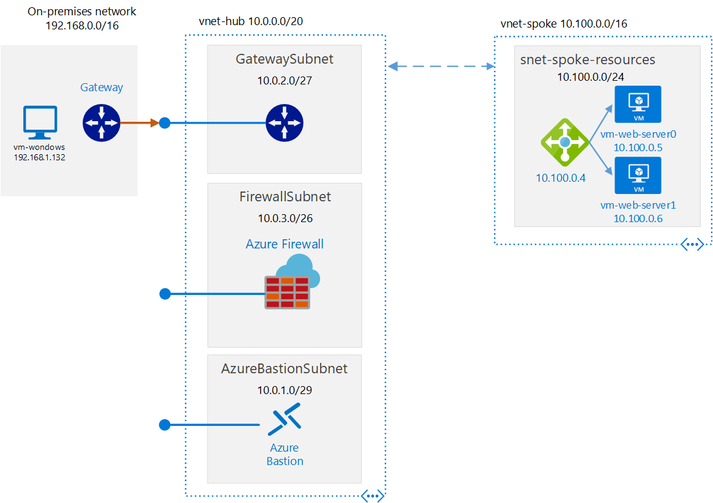
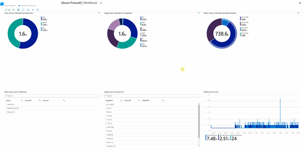

# **Azure Hub Spoke MicroHack**

Work in progress
# Contents

[MicroHack introduction](https://github.com/latj/hub-spoke-microhack#Introduction)

[Pre-requisites](https://github.com/latj/hub-spoke-microhack#Pre-requisites)

[Challenge 1: Understand Network Security Groups](https://github.com/latj/hub-spoke-microhack#challenge-1-understand-network-security-groups)

[Challenge 2: Understand routing and vNet peering](https://github.com/latj/hub-spoke-microhack#challenge-2-understand-routing-and-vnet-peering)

[Challenge 3: Route traffic through Azure Firewall](https://github.com/latj/hub-spoke-microhack#challenge-3-route-traffic-through-azure-firewall)

[Challenge 4: Monitoring](https://github.com/latj/hub-spoke-microhack#challenge-4-monitoring)

[Challenge 5: Control network with Azure Policies](https://github.com/latj/hub-spoke-microhack#challenge-5-control-network-with-azure-policies)

[Next step](https://github.com/latj/hub-spoke-microhack#next-step)

[Finished? Delete your lab](https://github.com/latj/hub-spoke-microhack#finished-delete-your-lab)


# Introduction

Azure hub-spoke network topology can be a core component in a customer's Azure foundation. In [this article](https://docs.microsoft.com/en-us/azure/cloud-adoption-framework/ready/enterprise-scale/network-topology-and-connectivity), the Enterprise Scale Framework explains how hub spoke may be used to create a network topology underpinning customer's foundation.
It is therefore important to understand how hub-spoke enables connectivity within Azure. The purpose of this MicroHack is to build that understanding by exploring some of the capabilities.
The lab starts with a single Hub with Spoke VNETs and default routing. We then connect a simulated on-premise location via S2S VPN. 
Prior to starting this MicroHack, please familiarize yourself with routing in Azure by reviewing the documentations inthe follow links.

[Implement a secure hybrid network](https://docs.microsoft.com/en-us/azure/architecture/reference-architectures/dmz/secure-vnet-dmz?tabs=portal)
[Hub-spoke network topology in Azure](https://docs.microsoft.com/en-us/azure/architecture/reference-architectures/hybrid-networking/hub-spoke?tabs=cli)

## Objectives

After completing this MicroHack you will:

- Know how to build a hub-and-spoke topology in Azure
- Understand routing and security with the hub-and-spoke architecture
- Understand how custom routing works and know how to build some custom routing scenarios
- Understand how to user Azure Firewall in hub-and-spoke topology
- Understand how to monitor the network and Azure Firewall
- Understand how to use Azure Policy to Control Networks

## Lab

The lab consists of a Hub and Spoke in the region you choose and a simulated On-premise location in same region.
Each of the Spoke and On-prem VNETs contains a Virtual Machine. The hub VNET contains an VPN Gateway and Azure Firewall.
During the course of the MicroHack you will deploy an additional spokes, and manipulate and observe routing.


# Pre-requisites

## Overview

In order to use the MicroHack time most effectively, the following tasks should be completed prior to starting the session.

With these pre-requisites in place, we can focus on building the differentiated knowledge in Azure Networking that is required when working with the products, rather than spending hours repeating relatively simple tasks such as setting up Virtual Networks and Virtual Machines. 

At the end of the pre-requisites your base lab build looks as follows:



In summary:

- "On-Premises" environment simulated by Azure Virtual Network
- "On-Premises" contains a windows VM (*vm-windows*)
- "On-Premises" is connected to Azure via a Site-to-Site VPN
- Azure contains a simple Hub and Spoke topology, containing a simple web application with two VMs in the spokes (*vm-web-server0, vm-web-server2*)
- Azure Bastion is deployed in hub VNet to enable easy remote desktop access to the Windows VMs
- All of the above is deployed within a two resource groups called *hub-spoke-microhack* and *mock-onprem-microhack*

## Task 1 : Deploy Template

We are going to use a predefined ARM template to deploy the base environment. It will be deployed in to *your* Azure subscription, with resources running in the your specified Azure region.

To start the ARM deployment, follow the steps listed below:

- Login to Azure cloud shell [https://shell.azure.com/](https://shell.azure.com/)
- Ensure the choose **Bash** as the terminal, it will not fully work with PowerShell!
- Ensure that you are operating within the correct subscription via:

`az account show`

- Chnage to your subscription if needed
  
`az account set --subscription mysubscription`

- Start the deployment, you can change location to a region of choose.   

`az deployment sub create     --template-uri https://raw.githubusercontent.com/latj/hub-spoke-microhack/master/azuredeploy.json --location eastus`

- Choose a suitable password to be used for your Virtual Machines administrator account (username: AzureAdmin)

- Wait for the deployment to complete. This will take around 45 minutes (the VPN gateways take a while).

## Task 2 : Explore and verify the deployed resources

- Verify you can access all Virtual Machines via Azure Bastion

Username: AzureAdmin

Password: {as per above step}

- Verify that your VNet Peering and Site-to-site VPN are funcitoning as expected. The easiest way to do this is as follows; Once you have Azure Bastion access to the desktop of *vm-web-server0*, launch remote desktop (mstsc), and attempt a connection to *vm-windows* (IP address 192.168.1.132). You should recieve the login prompt.


# Challenge 1: Understand Network Security Groups 

Azure Virtual Network (VNet) is the fundamental building block for your private network in Azure. VNet enables many types of Azure resources, such as Azure Virtual Machines (VM), to securely communicate with each other, the internet, and on-premises networks. VNet is similar to a traditional network that you'd operate in your own data center, but brings with it additional benefits of Azure's infrastructure such as scale, availability, and isolation.

In the spoke vnet it is deployed a loadbalancer and two VMs as backend pool. In this challange we will enable Network Security Groups (NSG) to filter the incomming traffic. 

## Task 1 : Control network access to VM with Network Security Groups

In Azure you can use an Azure network security group (NSG) to filter network traffic to and from Azure resources in an Azure virtual network. A network security group contains security rules that allow or deny inbound network traffic to, or outbound network traffic from, several types of Azure resources. For each rule, you can specify source and destination, port, and protocol.
A network security group can be associated on a subnet or on a NIC of a virtual machine.
More info about how it works [Network security group - how it works](https://docs.microsoft.com/en-us/azure/virtual-network/network-security-group-how-it-works)

In this task we need to block traffic to the VMs in the spoke subnet on all ports except port 80.

You can use the Azure Portal to configure this or just run the following commands in the Cloud Shell promt.

- An NSG already exist that you can used .

````Bash
az network nsg show -g "hub-spoke-microhack" -n "nsg-spoke-resources"
````

- Create new inbound rule allowing port 80 from onprem with this command

````Bash
az network nsg rule create -g "hub-spoke-microhack" \
  --nsg-name nsg-spoke-resources \
  --name allow-http-traffic-from-onprem \
  --priority 1100 \
  --source-address-prefixes "192.168.0.0/16" \
  --source-port-ranges '*' \
  --destination-address-prefixes "VirtualNetwork" \
  --destination-port-ranges '80' \
  --access Allow \
  --protocol '*' \
  --description "Allow onprem subnet traffic on port 80"

````

- Create new inbound rule denying all traffic from onprem

````Bash
az network nsg rule create -g "hub-spoke-microhack" \
  --nsg-name nsg-spoke-resources \
  --name deny-all-traffic-from-onprem \
  --priority 1110 \
  --source-address-prefixes "192.168.0.0/16" \
  --source-port-ranges '*' \
  --destination-address-prefixes "VirtualNetwork" \
  --destination-port-ranges '*' \
  --access Deny \
  --protocol '*' \--description "Deny onprem subnet traffic"

````

- Assign the NSG to the subnet 'snet-spoke-resources'in spoke 'vnet-spoke'.

````Bash
az network vnet subnet update -g "hub-spoke-microhack"  \
  --name "snet-spoke-resources" \
  --vnet-name vnet-spoke \
  --network-security-group nsg-spoke-resources
````

## Task 2 : Verify the network access from VM 
To verify if the right access is configured, test it from the VM in onprem vnet *vm-windows* 
Do as follows; 
Use Azure Bastion to access the desktop of *vm-windows*, 
- Launch remote desktop (mstsc), and attempt a connection to *vm-web-server0* (IP address 10.100.0.5). You should not recieve the login prompt.
- Lanuch a Internet Explorer and browse to *vm-web-server0* http://10.100.0.5 or *vm-web-server1* http://10.100.0.6 or *loadBalancer* http://10.100.0.4. and you will se the default web page. Note the IP of the webservers can differ due some timing issues during deployment.

## Task 3 : Verify the network access with NetworkWatcher 
You can verify the access with the NetworkWatcher service in Azure, you can read more about the service [here](https://docs.microsoft.com/en-us/azure/network-watcher/network-watcher-monitoring-overview)

To use NetworkWatcher eather from CLI/PowerShell on in the portal 


- Command to test if port 3389 (MSTSC) is working.

````Bash
az network watcher test-ip-flow \
  --direction inbound \
  --local 10.100.0.6:3389 \
  --protocol TCP \
  --remote 192.168.1.132:60000 \
  --vm vm-web-server0 \
  --nic nic-web-server0 \
  --resource-group hub-spoke-microhack
  ````


- Command to test if port 80 is working.

````Bash
az network watcher test-ip-flow \
  --direction inbound \
  --local 10.100.0.6:80 \
  --protocol TCP \
  --remote 192.168.1.132:60000 \
  --vm vm-web-server0 \
  --nic nic-web-server0 \
  --resource-group hub-spoke-microhack
  ````

:point_right: The result of the challange:
- Network Security Groups NSG, can be used to filter inbound and outboind traffic to subnets and nic on VMs


# Challenge 2: Understand routing and vNet peering 

In this challenge we will work with routing and peering in Virtual Networks, we will start by adding one more spoke virtual network to the hub network.
 

## Task 1 : Deploy a new spoke Virtual Network

In this task we need to create a new vnet, that can be done by using the portal or run the following command in your cloud shell session.
When creating a Virtual Network you need to specify an address prefix, that must be non overlapping ip-range, more info about [what address range can I use](https://docs.microsoft.com/en-us/azure/virtual-network/virtual-networks-faq#what-address-ranges-can-i-use-in-my-vnets)

- Create a new spoke nvet named *vnet-spoke2* with a subnet named *snet-spoke-resources*, with the following command.

````Bash
az network vnet create -g hub-spoke-microhack \
  -n vnet-spoke2 \
  --address-prefix 10.200.0.0/16 \
  --subnet-name snet-spoke-resources \
  --subnet-prefix 10.200.0.0/24
````
## Task 2 : Peer the new spoke to hub

Now we need to connect the the newly created with the hub vnet. That is done by peering them, it is done in two steps, first from spoke to hub, then from hub to spoke.
in the case we will allow the spoke to be able to connect to onprem through VPN.
More info about [Virtual Network peering](https://docs.microsoft.com/en-us/azure/virtual-network/virtual-network-peering-overview)  

- Run the following command to peer the new spoke with hub

````Bash
    # Creates peering between vnets
    az network vnet peering create -g hub-spoke-microhack  \
    --name spoke2-hub-peer \
    --vnet-name vnet-spoke2 \
    --remote-vnet vnet-hub \
    --allow-vnet-access  \
    --use-remote-gateways
    az network vnet peering create -g hub-spoke-microhack  \
    --name hub-spoke-peer \
    --vnet-name vnet-hub \
    --remote-vnet vnet-spoke2 \
    --allow-vnet-access \
    --allow-forwarded-traffic \
    --allow-gateway-transit
````

- We need a new VM in the new VNET so we create one. Yuo need to specify the password for the AzureAdmin user.


````Bash
    az network nic create --resource-group hub-spoke-microhack \
    --name nic-mgmt-server \
    --subnet snet-spoke-resources \
    --private-ip-address 10.200.0.4 \
    --vnet-name vnet-spoke2
    az vm create  --resource-group hub-spoke-microhack \
    --name vm-mgmt-server \
    --image win2019datacenter \
    --nics nic-mgmt-server \
    --admin-username AzureAdmin
````

- Verify that your can access the new VM as expected. The easiest way to do this is as follows; Once you have Azure Bastion access to the desktop of *vm-windows*, launch remote desktop (mstsc), and attempt a connection to *vm-mgmt-server* (IP address 10.200.0.4). You should recieve the login prompt.

## Task 3 : Check the routing for Virtual Machines

We will check the routing configuration of the first webserver in the spoke netwotk *vm-web-server0*, that can be done by using the commands CLI below or using the portal.


- Show the routing for vm *vm-web-server0* by specifiying the nic *nic-web-server0*.

````Bash
    az network nic show-effective-route-table -g "hub-spoke-microhack" \
    -n "nic-web-server0" \
    --output table
````

### :point_right: The result will show the following.


> - 1st route shows the addressprefix of the *vnet-spoke* nexthop VirtualNetwork named VNetLocal in CLI

> - 2nd route shows the addressprefix of the peered vnet, with nexthop VNet peering

> - 3rd route shows the addressprefix of the onprem, with nexthop VirtualNetworkGateway

> - 4th route shows the 0.0.0.0/0, with nexthop Internet

> - The rest show addressprefixes that will be droped


### :point_right: In this senario all traffic to internet will breakout directly in the virtual network.

You can read more about routing in Azure [here](https://docs.microsoft.com/en-us/azure/virtual-network/virtual-networks-udr-overview#default)


- Now check the routing for  *vm-mgmt-server* by specifiying the nic *nic-mgmt-server*.

````Bash
    az network nic show-effective-route-table -g "hub-spoke-microhack" \
    -n "nic-mgmt-server" \
    --output table
````

### :point_right: Compare them and look for differernces

:question: Will *vm-web-server0* and *vm-mgmt-server* be able to communicate?

:question: Why can't they communicate?

- Peering connections are non-transitive, low latency connections between virtual networks. Once peered, the virtual networks exchange traffic by using the Azure backbone without the need for a router.
More infomation [Virtual Network Peering](https://docs.microsoft.com/en-us/azure/virtual-network/virtual-network-peering-overview#connectivity)

# Challenge 3: Route traffic through Azure Firewall

In this challenge you will explore how we can make our spokes communicate by sending all traffic through a Firewall, instead of go direct to Internet. You will route all traffic directly to the Azure Firewall. The Firewall is allready created for you.

So with User Defined Routes (UDR) or Route Table in Azure, you can defined route where nexthop will be. 


## Task 1: Check the deployment of Azure Firewall

In the Azure Portal, you see a AzureFirewall resource in the your resource group. A subnet named "AzureFirewallSubnet" must exist to be able to deploy Azure Firewall. 

Go to your Azure Firewall instance's "Overview" and take note of its private IP address:


## Task 2: Configure a default route to send traffic to Azure Firewall


So in this task we will configure route tables that all traffic will be sent to Azure Firewll for all spokes and for onprem access.
First find the Route Table "spoke-route" and check the next hop of the default route. To do so, click on “Routes” on the menu on the left, find the custom default route that you defined in the previous challenge and click on it. The next hop should be "VirtualAppliance" with the private IP of your Azure firewall instance, Don't forget to click save. 


Now we have configured the route table, now we need to assign it, to each subnets in spokes. That can be done by running the following commands to update the configuration. 

````Bash
    # assign routetable to subnets in spokes 
    az network vnet subnet update -g "hub-spoke-microhack" \
    -n snet-spoke-resources \
    --vnet-name vnet-spoke \
    --route-table spoke-routes
    az network vnet subnet update -g "hub-spoke-microhack" \
    -n snet-spoke-resources \
    --vnet-name vnet-spoke2 \
    --route-table spoke-routes

````

Now we have configured route-table for all spokes. For the onprem traffic we need to defined the route table for the Virtual Network Gateway. Find the Route Table "gateway-route" and check the next hop for each spoke. It isn't recommended to configure 0.0.0.0/0 you need to do one entry per spoke vnet. The route for the first spoke already exist. So you need to add the route for **vnet-spoke2**. Dont forget to click **Save**.


To assign the route table run the following command.

````Bash
    # assign routetable to gateway subnet
    az network vnet subnet update -g "hub-spoke-microhack" \
    -n GatewaySubnet \
    --vnet-name vnet-hub \
    --route-table gateway-routes
````

:question: Verify if you still have connectivity to the internet from the *vm-mgmt-server*.

Connections are now being routed to Azure Firewall, which is running with the default "deny all" policy.

:question: Verify if you have connectivity to *vm-web-server0* from the *vm-mgmt-server*.


Now check the routing for *vm-mgmt-server* by specifiying the nic *nic-mgmt-server* to se what have change after applying the route table.

````Bash
    az network nic show-effective-route-table -g "hub-spoke-microhack" \
    -n "nic-mgmt-server" \
    --output table
````

## Task 3: Implement policy with Azure Firewall rules to connect to Internet

In this task you will start to configure Appliction rules to allow traffic to Internet, in this senario we are using Azure Firewall with Azure Firewall Policy, more info. 

You will add an Application rule to allow the servers in *vnet-spoke2* to access microsoft.com

- We will start to create the Appliaction rule, because this is the first rule, we need to create a Collection Group first, and the the Application Rule Collection.

````Bash
  
  az network firewall policy rule-collection-group create --name ApplicationCollGroupAzureFirewall \
    --policy-name azurefirewallPolicy \
    --resource-group hub-spoke-microhack \
    --priority 100
  az network firewall policy rule-collection-group collection add-filter-collection -g hub-spoke-microhack \
    --policy-name azurefirewallPolicy \
    --rule-collection-group-name ApplicationCollGroupAzureFirewall  \
    --name Application-Collection \
    --action Allow \
    --rule-name Allow-Microsoft \
    --rule-type ApplicationRule \
    --source-addresses "10.200.0.0/16" \
    --protocols Http=80 Https=443 \
    --target-fqdns "*.microsoft.com" \
    --collection-priority 100
````
Now you can verify if the rule is working. If you test to browse to https://docs.microsoft.com from the VM *vm-mgmt-server*

In Azure Firewall you can also configure predefined fqdn tag for function like WindowsUpdate, WindowsDianostics, Azure Abckup and more see link for [info](https://docs.microsoft.com/en-us/azure/firewall/fqdn-tags)

- To be able update VMs with Security Pacthes you need to Allow them to communicate to Windows Update, run the following command.

````Bash

# Error!!!
az network firewall policy rule-collection-group collection add-filter-collection -g hub-spoke-microhack \
    --name Application-Collection2 \
    --policy-name azurefirewallPolicy \
    --rule-collection-group-name ApplicationCollGroupAzureFirewall  \
    --name Application-Collection \
    --action Allow \
    --rule-name Allow-WindowsUpdate \
    --rule-type ApplicationRule \
    --source-addresses "10.200.0.0/16" \
    --protocols Https=443 \
    --fqdn-tags WindowsUpdate \
    --collection-priority 100
````


## Task 4: Azure Firewall rules and route tables to connect between spokes and to on-prem

In this task we will create Network rules, so we can control traffic beween spokes, on or case allow traffoce from **vnet-spoke2** to the *loadbalancer* in **vnet-spoke**

to Allow traffic we need first to create a Network rule collection, and then add the network rule, you can use the commad below to create a rule that allow http traffic from **nvet-spoke2** (10.200.0.0/16) to **lb-internal** (10.100.0.4)

````BAsh
  
  az network firewall policy rule-collection-group create --name NetworkCollGroupAzureFirewall \
    --policy-name azurefirewallPolicy \
    --resource-group hub-spoke-microhack \
     --priority 200
  az network firewall policy rule-collection-group collection add-filter-collection -g hub-spoke-microhack \
    --policy-name azurefirewallPolicy \
    --rule-collection-group-name NetworkCollGroupAzureFirewall  \
    --name Network-Collection \
    --action Deny \
    --rule-name Deny-http80 \
    --rule-type NetworkRule \
    --source-addresses "10.200.0.0/16" \
    --destination-ports 80 \
    --ip-protocols TCP UDP \
    --destination-addresses "10.100.0.0/16"  \
    --collection-priority 201
 
````


## :checkered_flag: Results

You have implemented a Azure Firewall, which allows to control internet access and traffic between spoke vnets.

# Challenge 4: Monitoring

In this challenge we will go through how we can monitor and detect allert on network resources in Azure.

## Task 1: Azure Monitor Network Insights
The Azure Monitor Network Insights Overview page provides an easy way to visualize the inventory of your networking resources, together with resource health and alerts. It's divided into four key functional areas: search and filtering, resource health and metrics, alerts, and dependency view. More info [here](https://docs.microsoft.com/en-us/azure/azure-monitor/insights/network-insights-overview)

In the Azure Portal open Azure Monitor Network Insights Overview page


## Task 2: Network watcher

Azure Network Watcher provides tools to monitor, diagnose, view metrics, and enable or disable logs for resources in an Azure virtual network. Network Watcher is designed to monitor and repair the network health of IaaS (Infrastructure-as-a-Service) products which includes Virtual Machines, Virtual Networks, Application Gateways, Load balancers, etc. Note: It is not intended for and will not work for PaaS monitoring or Web analytics.

When you create a VM, Azure allows and denies network traffic to and from the VM, by default. You might later override Azure's defaults, allowing or denying additional types of traffic.
1.	In the portal, select **All services**. In the **All services** Filter box, enter *Network Watcher*. When **Network Watcher** appears in the results, select it.
2.	Select **IP flow verify**, under **NETWORK DIAGNOSTIC TOOLS**.
3.	Select your subscription, enter or select the following values, and then select **Check**, as shown in the picture that follows


If no NSG is applied following error will occure

Error code: NsgsNotAppliedOnNic
*Error message: No NSG applied on nic to allow or block traffic, nic id /subscriptions/xxxxxxxx-xxxx-xxxx-xxxx-xxxxxxxxxxxx/resourceGroups/hub-spoke-microhack/providers/Microsoft.Network/networkInterfaces/nic-mgmt-server.*


### View details of a security rule
1.	To determine why the rules in steps 3-5 of **Use IP flow verify** allow or deny communication, review the effective security rules for the network interface in the VM. In the search box at the top of the portal, enter *myvm*. When the **myvm** (or whatever the name of your network interface is) network interface appears in the search results, select it.
2.	Select **Effective security rules** under **SUPPORT + TROUBLESHOOTING**, as shown in the following picture:


### View details of a next hop


## Task 3: Workbook Azure Firewall

In this senario an Azure workbook is already deployed, you can find it in the **hub-spoke-microhack**. Open that resouce, and click **Open workbook**


When you open the Workbook you need to specify the workspace in **hub-spoke-microhack** resource group and the **Azure Firewall**

### Overview page

The overview page provides you with a way to filter across workspaces, time, and firewalls. It shows events by time across firewalls and log types (application, networks, threat intel, DNS proxy).


### Application rule log statistics

This page shows unique sources of IP address over time, application rule count usage, denied/allowed FQDN over time, and filtered data. You can filter data based on IP address.


### Network rule log statistics

This page provides a view by rule action – allow/deny, target port by IP and DNAT over time. You can also filter by action, port, and destination type.



### Investigations

You can look at the logs and understand more about the resource based on the source IP address. You can get information like virtual machine name and network interface name. It's simple to filter to the resource from the logs.


# Challenge 5: Control network with Azure Policies
With Azure Policy you can enforce organizational standards and to assess compliance at-scale. Common use cases for Azure Policy include implementing governance for resource consistency, regulatory compliance, security, cost, and management. Policy definitions for these common use cases are already available in your Azure environment as built-ins to help you get started. But you can also crate your own Azure Policy

For more information, see [Azure Policy documentation.](https://docs.microsoft.com/en-us/azure/governance/policy/overview)

Each policy definition in Azure Policy has a single effect. They can be Append, Audit, AuditIfNotExists, Deny, DeployIfNotExists, Disabled or Modify. In this task wil will only use DeployIfNotExists, so it will deploy resources that are missing, in this task a Route Table and assign it. More info [Understand Azure Policy effects](https://docs.microsoft.com/en-us/azure/governance/policy/concepts/effects) 

## Task 1: Add Azure policy to control configuration of Virtual Network
In the this task you will create a custom policy definition named *Deploy a user-defined route to a VNET with specific routes*, that will deploy a route table if it does not exist.

So in the Azure Portal navigate to the Azure Policy and then definitions, and click on *+ Policy definition* to add a new.

- sepcifiy the definition location, choose your subscription.
- Specify the name *Deploy a user-defined route to a VNET with specific routes*
- Add a description 
- Choose an existing Category, *Network*
- In the policy rule remove the default one. Copy and paste the policy below instead.

````json
    {
  "mode": "Indexed",
  "policyRule": {
    "if": {
      "allOf": [
        {
          "field": "type",
          "equals": "Microsoft.Network/virtualNetworks"
        },
        {
          "field": "location",
          "equals": "[parameters('vnetRegion')]"
        }
      ]
    },
    "then": {
      "effect": "[parameters('effect')]",
      "details": {
        "type": "Microsoft.Network/routeTables",
        "roleDefinitionIds": [
          "/providers/Microsoft.Authorization/roleDefinitions/4d97b98b-1d4f-4787-a291-c67834d212e7"
        ],
        "existenceCondition": {
          "allOf": [
            {
              "field": "Microsoft.Network/routeTables/routes[*].nextHopIpAddress",
              "equals": "[parameters('defaultRoute')]"
            }
          ]
        },
        "deployment": {
          "properties": {
            "mode": "incremental",
            "parameters": {
              "udrName": {
                "value": "[concat(field('name'),'-udr')]"
              },
              "udrLocation": {
                "value": "[field('location')]"
              },
              "defaultRoute": {
                "value": "[parameters('defaultRoute')]"
              }
            },
            "template": {
              "$schema": "http://schema.management.azure.com/schemas/2018-05-01/subscriptionDeploymentTemplate.json",
              "contentVersion": "1.0.0.0",
              "parameters": {
                "udrName": {
                  "type": "string"
                },
                "udrLocation": {
                  "type": "string"
                },
                "defaultRoute": {
                  "type": "string"
                }
              },
              "variables": {},
              "resources": [
                {
                  "type": "Microsoft.Network/routeTables",
                  "name": "[parameters('udrName')]",
                  "apiVersion": "2020-08-01",
                  "location": "[parameters('udrLocation')]",
                  "properties": {
                    "routes": [
                      {
                        "name": "AzureFirewallRoute",
                        "properties": {
                          "addressPrefix": "0.0.0.0/0",
                          "nextHopType": "VirtualAppliance",
                          "nextHopIpAddress": "[parameters('defaultRoute')]"
                        }
                      }
                    ]
                  }
                }
              ],
              "outputs": {}
            }
          }
        }
      }
    }
  },
  "parameters": {
    "defaultRoute": {
      "type": "String",
      "metadata": {
        "displayName": "Default route to add into UDR",
        "description": "Policy will deploy a default route table to a vnet"
      }
    },
    "vnetRegion": {
      "type": "String",
      "metadata": {
        "displayName": "VNet Region",
        "description": "Regional VNet hub location",
        "strongType": "location"
      }
    },
    "effect": {
      "type": "String",
      "metadata": {
        "displayName": "Effect",
        "description": "Enable or disable the execution of the policy"
      },
      "allowedValues": [
        "DeployIfNotExists",
        "Disabled"
      ],
      "defaultValue": "DeployIfNotExists"
    }
  }
}
````
- Click Save

## Task 2: Assign Azure policy to control configuration of Virtual Network

OK, now you need to assign the policy to a scope, it can be Management Group, Subscription or Resource Group. In this case it will be a Resource Group. But first we create an emtry resource group, where to specify the scope to.

````Bash
    az group create -l EastUS -n spoke-microhack
````
Now we can assign the the policy to the newly created Resource Group, using the portal navigate to Azure policy and open the Policy definition you created before. In the top robbon click Assign.

- Change th scope to the newly created resource group.
- Click Next
- Specify the parameters, 
  -  Default route the IP-address of your Azure firewall (10.0.3.4)
  -  VNet Region, the region where you have deployed your resources
  -  Effect, leave it as *DeployIfNotExists*
- Click *Review + create*

It normally takes around 30 minutes for a newly applied assignment to be applied. You speed up this process you can run following commad to manually trigger a evaluation scan.

````Bash
    az policy state trigger-scan --resource-group spoke-microhack
````
You can choose not to wait for the asynchronous process to complete before continuing with the no-wait parameter.

You can monitor the status of the evaluation in the activity log of the resource group, it takes around 15 min.

While you are waiting you can read more about how the policies are triggered. [Evaluation triggers](https://docs.microsoft.com/en-us/azure/governance/policy/how-to/get-compliance-data)

## Task 3: Verify if Azure policy works

Now you can verify that the poilcy working, you can do that by creating a new VNet in the Resource Group *spoke-microhack* with a subnet. After it been created you can check the activity log.
And after some time a Route Table will be created in the Resouce Group, and it will be assign to the subnets.


# Next step

If you would like to understand more and follow Microsoft recommeded configuration, you can take a look at Cloud Adoption Framework(CAF) there is sections about [Best practices](https://docs.microsoft.com/en-us/azure/cloud-adoption-framework/ready/azure-best-practices/) where you read more.

In the CAF you can find info about Azure Landing zones and design guidelines that can be good to understand, more info [here](https://docs.microsoft.com/en-us/azure/cloud-adoption-framework/ready/enterprise-scale/design-guidelines) And also specific infomation regaring hub-spoke networking, more info [here.](https://docs.microsoft.com/en-us/azure/cloud-adoption-framework/ready/enterprise-scale/network-topology-and-connectivity) 


# Finished? Delete your lab

- Delete the resource group hub-spoke-microhack, mock-prem-microsoft and spoke-microhack
- Remember to remove the Azure policy assignment and policy definition


Thank you for participating in this MicroHack!


